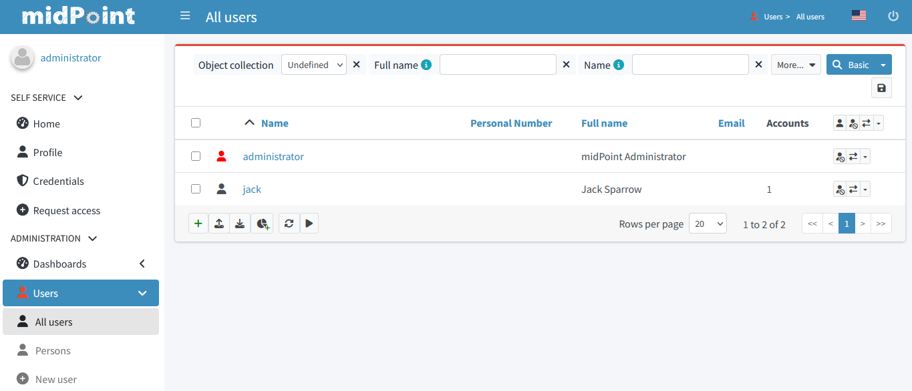
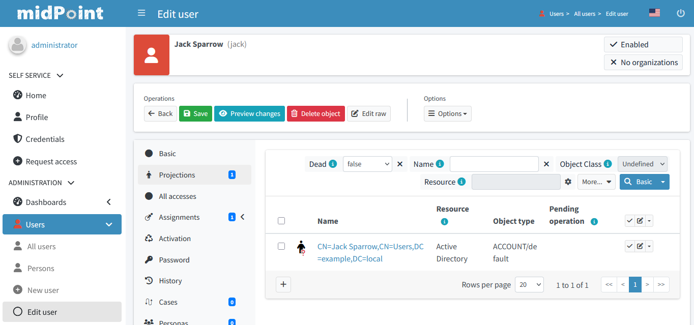

= Testing midPoint with AD resource

This repository contains a simple midPoint instance configured to access Active Directory system.

== Prerequisites

. Docker Desktop
. Running AD

=== How to run AD

If necessary, the AD can be created by cloning https://github.com/splitbrain/vagrant-active-directory.git and running it by `vagrant up`.

Note that the process may take quite a long time and require a few reboots of the virtual machine.

After the installation, it should be possible to connect to the VM as described in https://github.com/splitbrain/vagrant-active-directory.

NOTE: If you'd like to use a different AD installation, please change the connection parameters in `ad-test-env/midpoint_server/container_files/mp-home/post-initial-objects/100-resource-ad.xml`

== Installation

After AD machine is up and running, the you can start midPoint by running `docker compose up` in `ad-test-env` subdirectory.

NOTE: You may need to remove any pre-existing configurations by runing `docker compose down -v` before starting it up.

== Running

MidPoint will run at `localhost:8080`.

=== Checking that midPoint lives

1. Log into midPoint using a browser.
Credentials: `administrator` / `SUPER5ecr3t`.
+
image::login.png[]

2. Check that you see `administrator` and `jack` users there.
+

3. Check that `jack` has a single account (projection) on AD resource.
+

=== Checking the REST interface

1. Run `get-ad-resource-status.sh` and check that the AD resource is up (see `lastAvailabilityStatus`):
+
[source,json]
----
{
  "resource" : {
    "oid" : "baaad572-97d0-491e-9b4a-024633533778",
    "version" : "2",
    "name" : "Active Directory",
    "operationalState" : {
      "lastAvailabilityStatus" : "up",
      "message" : "Status set to UP because resource schema was successfully fetched",
      "timestamp" : "2026-05-25T15:05:00.422Z",
      "nodeId" : "DefaultNode"
    }
  }
}
----

2. Run `get-user-jack.sh` and check it has a single account represented by a `linkRef` value (but you already checked that in the GUI):
+
[source,json]
----
{
  "user" : {
    "oid" : "ad3fb4ef-49d7-464b-a4e5-f3f019b1dd11",
    "version" : "4",
    "name" : "jack",
    "linkRef" : {
      "oid" : "871c59db-b1dc-4d25-a801-7c60a2bf7597",
      "relation" : "org:default",
      "type" : "c:ShadowType"
    },
    "fullName" : "Jack Sparrow"
  }
}
----

=== Sending the notification about a password change

Run `notify-password-change.sh`.
It will send out the following REST message (see `notify-password-change.json`):

[source,json]
----
{
	"resourceObjectShadowChangeDescription": {
		"oldShadow": {
			"resourceRef": {
				"oid": "baaad572-97d0-491e-9b4a-024633533778",
				"type": "c:ResourceType"
			},
			"objectClass": "ri:user",
			"attributes": {
				"ri:sAMAccountName": "jack"
			}
		},
		"objectDelta": {
			"@ns": "http://prism.evolveum.com/xml/ns/public/types-3",
			"changeType": "modify",
			"objectType": "ShadowType",
			"itemDelta": {
				"modificationType": "replace",
				"path": "credentials/password/value",
				"value": "y0uR_P455woR*d"
			}
		}
	}
}
----

There should be no error message, and the `mail-notifications.txt` file should contain this:

----
# Here will come mail notifications
============================================
Mon May 25 15:26:50 UTC 2026
Message{to='[recipient@evolveum.com]', cc='[]', bcc='[]', subject='User password notification', contentType='null', body='Password for user jack is: y0uR_P455woR*d
----
